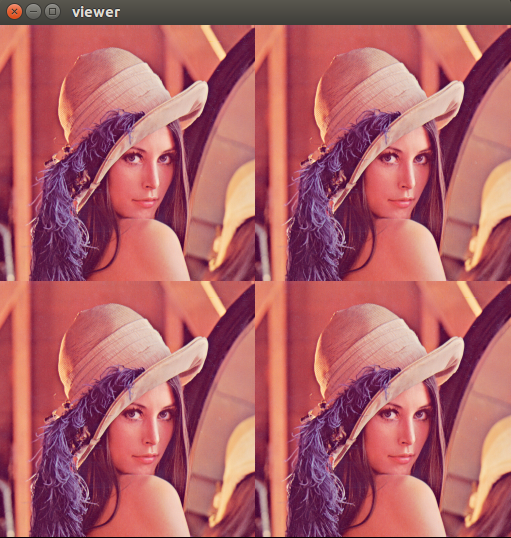
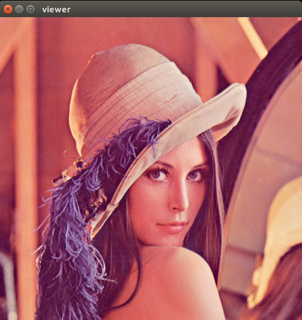

# ImgView
Non-blocking image viewer written in C++ using OpenGL

<p align="center"></p>

## Requirements
- OpenGL 3.3
- glfw3 (for window management)
- gl3w (for window management)
- glm (for opengl math)
- stb_image (for image I/O)

Place gl3w headers (`gl3w.h`, `glcorearb.h`) under `include/imgview/ext/gl3w`, `stb_image.h` under `include/imgview/` and `glw3.c` under `src`.


## Major classes
- `Image`: container for pixel data
- `Mosaic`: place on which you layout multiple tessarae
- `Tessera`: Each tesserae is abstraction of an image on mosaic
- `Shader`: basic shader to render data
- `Window`: for rendering
- `Renderer`: Has access to the shader and renders each tesserae by manipulating the base vertex buffer


## Usage

- Clone and build
```bash
git clone git@github.com:kvmanohar22/imgview.git
cd imgview
mkdir build
cd build
cmake ..
```

- Simple rendering

```bash
cd path/to/build
make test_simple1
./test_simple1
```

```c++
// Create (empty) mosaic and window
Mosaic* mosaic = new Mosaic();
Window* window = new Window(w, h, "viewer", mosaic);

// Load an image
Image* image = new Image("/path/to/image");

// Add the image to mosaic
const size_t start_x = 0;
const size_t start_y = 0;
const size_t width = w;
const size_t height = h;

// image is internally converted to tesserae
mosaic->add(image, start_x, start_y, width, height);

// Render
window->show();

// do your stuff here. Rendering is in a separate thread
```
... and the result

<p align="center"></p>

- Multiple images

```bash
cd path/to/build
make test_simple2
./test_simple2
```

```c++
// Load an image
Image* image = new Image("/path/to/image");

// Add four images
mosaic->add(image, 0, 0, w/2, h/2);
mosaic->add(image, w/2, h/2, w/2, h/2);
mosaic->add(image, w/2, 0, w/2, h/2);
mosaic->add(image, 0, h/2, w/2, h/2);

// Render
window->show();
```
... and the result

<p align="center"></p>

